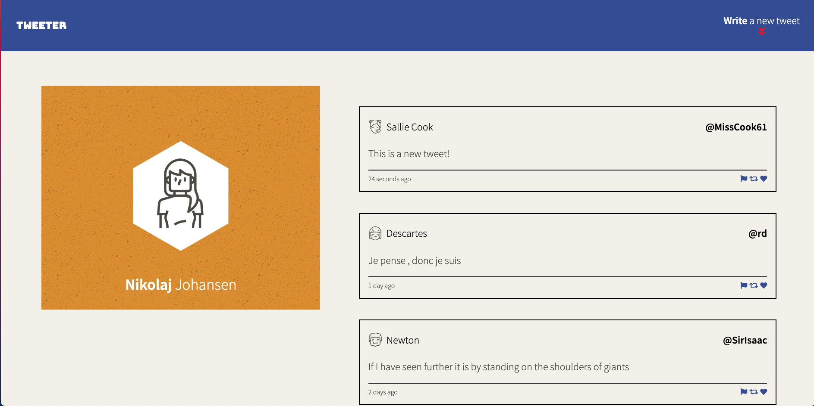
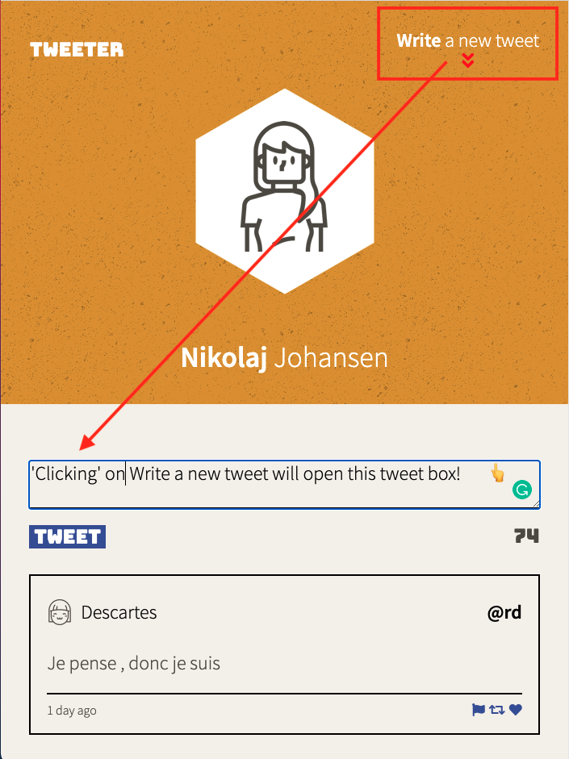
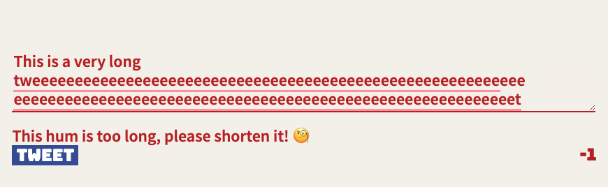

# Tweeter Project

A single-page AJAX-based Twitter clone that uses jQuery, HTML5, and plain ol' CSS3 for styling. 

It is equiped with media quiries to ensure it is responsive on both desktops and mobile devices. Animations on the page are achieved with CSS transitions, Keyframes, and jQueries animation functions.

## Final Product

Desktop display
 
Mobile display and write a tweet button

Error message if tweet is too long. 

## Getting Started

1. Fork this repository, then clone your fork of this repository.
2. Install dependencies using the `npm install` command.
3. Start the web server using the `npm run local` command. The app will be served at <http://localhost:8080/>.
4. Go to <http://localhost:8080/> in your browser.

## Dependencies

- Express
- Node 5.10.x or above
- body-parser
- chance
- Timeago
- md5
